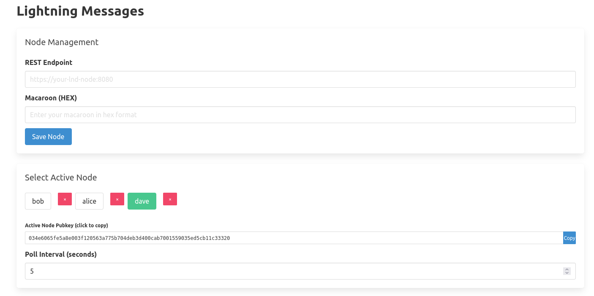
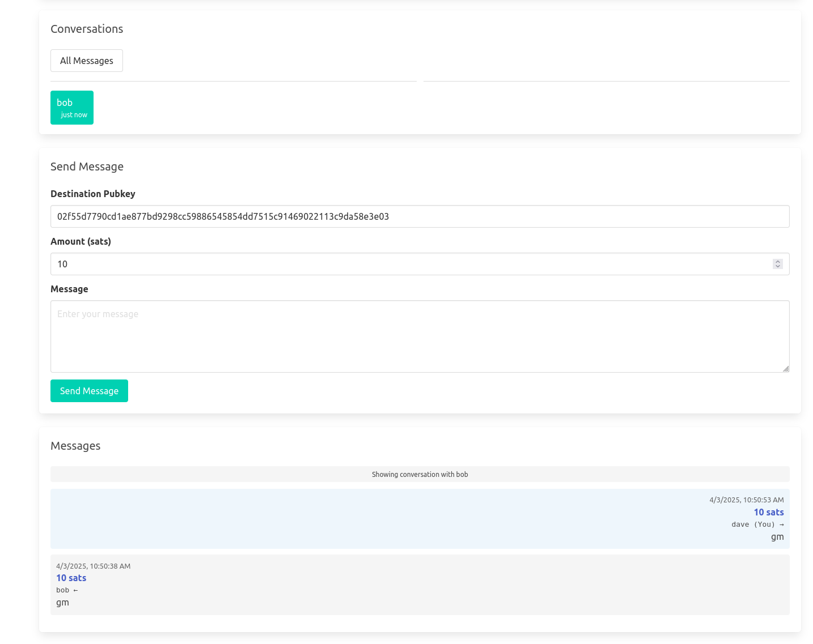

# send_sats
Small browser application to keysend notes to different nodes

- No database required using only lnd node's invoices to store and display chat messages
- Easy ability to chat between more than one node
- Can see all messages across conversations or one conversation at a time
- No server besides the lnd nodes required
- Uses the standard keysend custom record defined here: https://github.com/satoshisstream/satoshis.stream/blob/main/TLV_registry.md

